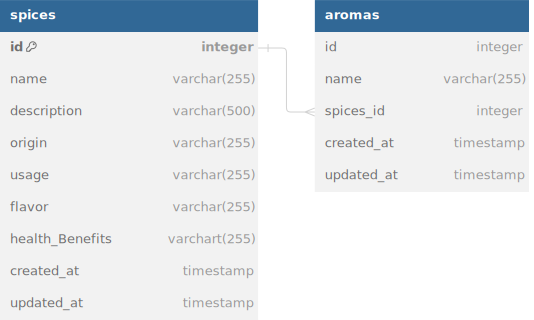

# Spices

    Spices API for listing spices in Indonesia

## REST API specification

- Production : <https://spices-yw2x.onrender.com>
- Local : <http://localhost:3000>

| Endpoint         | HTTP     | Desctription           |
| ---------------- | -------- | ---------------------- |
| `/spices`        | `GET`    | Get all spices         |
| `/spices/:id`    | `GET`    | Get one spice by id    |
| `/spices`        | `POST`   | add new spice          |
| `/spices`        | `DELETE` | delete all spices      |
| `/spices/:id`    | `DELETE` | delete one spice by id |
| `/spices/:id`    | `PUT`    | Update one spice by id |
| `/spices/seeded` | `PUT`    | seed many spices       |

## Database Design/Schema/Entity Relationship Diagram (ERD)



## Getting Started

To install dependencies:

```sh
bun install
```

To run:

```sh
bun run dev
```

open <http://localhost:3000>
